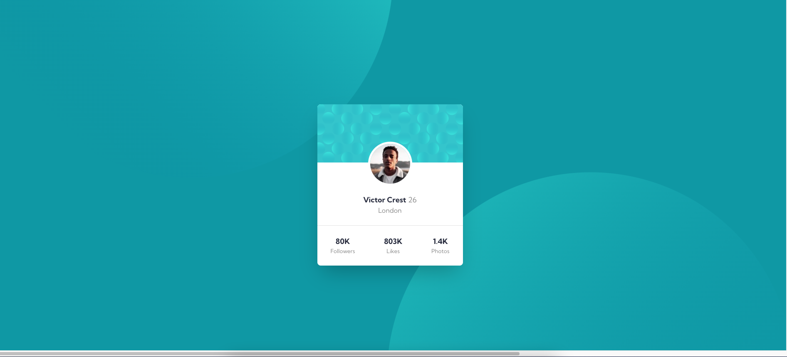

# Frontend Mentor - Profile card component solution

This is a solution to the [Profile card component challenge on Frontend Mentor](https://www.frontendmentor.io/challenges/profile-card-component-cfArpWshJ). Frontend Mentor challenges help you improve your coding skills by building realistic projects.

## Table of contents

- [Overview](#overview)
  - [The challenge](#the-challenge)
  - [Screenshot](#screenshot)
  - [Links](#links)
- [My process](#my-process)
  - [Built with](#built-with)
  - [What I learned](#what-i-learned)
  - [Continued development](#continued-development)
- [Author](#author)
- [Acknowledgments](#acknowledgments)

## Overview

### The challenge

- Build out the project to the designs provided

### Screenshot

### Links

- Solution URL: [Github](https://github.com/thisisadityarao/FM-profile-card-component)
- Live Site URL: [Github Pages](https://thisisadityarao.github.io/FM-profile-card-component/)

## My process

### Built with

- Semantic HTML5 markup
- CSS custom properties
- Flexbox
- CSS Grid
- Mobile-first workflow

### What I learned

I thought this challenge was going to be easy, but I was wrong. The only place that tripped me was setting background image. I just couldn't get it to work.
After looking for some help at FM's discord, I found a link to [@grace-snow](https://www.frontendmentor.io/profile/grace-snow) solution. And here is where I learned about using pseudo elements `::after` and `::before` for setting background images.

### Continued development

Pseudo elements are really useful. Would start exloring how other dev's make use of them.

## Author

- Website - [Aditya Rao](https://adityarao.netlify.app/)
- Frontend Mentor - [@thisisadityarao](https://www.frontendmentor.io/profile/thisisadityarao)
- Twitter - [@thisisadityarao](https://www.twitter.com/thisisadityarao)

## Acknowledgments

[@grace-snow](https://www.frontendmentor.io/profile/grace-snow)

What I learned and needed help with was the background images. I tried, but couldn't get it to work. So I searched FM's discord for some help or inspiration and I found @grace-snow comment with link to their take on this challenge.
It was really helpful. I learned something new.

Here is the [solution](https://www.frontendmentor.io/solutions/profile-card-with-pseudo-backgrounds-and-accessible-list-577BPZiIm)
